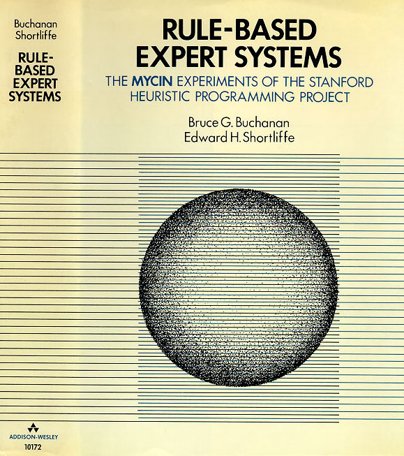

# Fondamentaux de l'intelligence artificielle -2

##  Activité 1: Approche symbolique et approche connexionniste

Cette activité aborde une question fondamentale en intelligence artificielle : **comment un ordinateur peut-il reconnaître un chiffre écrit** ?

   
   
  <em>Figure 1 : Extrait de la base de données <a href="https://en.wikipedia.org/wiki/MNIST_database" target="_blank">MNIST</a>, de chiffres écrits à la main et étiquetés soit par leur valeur dans le <code>training image</code> soit par le résultat de leur reconnaissance dans le <code>test image</code>.</em>

Pendant longtemps, les informaticiens ont tenté de répondre à cette question en écrivant des règles explicites — c'est ce qu'on appelle l'**approche symbolique**, ou les systèmes experts. Cette approche a connu de grands succès dans certains domaines, mais s'est heurtée à des limites profondes dès qu'il s'agissait de traiter des données issues du monde réel, comme l'écriture manuscrite.

Dans cette activité, vous allez explorer ces limites par vous-même, en tentant de construire un tel système pour la reconnaissance de chiffres en 10x10 pixels. Vous verrez pourquoi cette tâche, intuitivement simple pour un humain, résiste à toute tentative de description par des règles.

Cette expérience motivera l'introduction d'une approche radicalement différente : l'**approche connexionniste**, dans laquelle le programme n'est plus programmé avec des règles, mais apprend à partir d'exemples.

[Lancer l'activité 1: Expliquer à un ordinateur ce qu'est un 3](https://nablanabla.github.io/Fondamentaux-de-l-IA_2/phase1-symbolique/)

**Durée estimée :** 20 minutes

### Quelques succès de l'approche symbolique en sciences de la santé

L'approche symbolique a pourtant connu de véritables succès dans des domaines bien délimités. Le système expert [MYCIN](https://en.wikipedia.org/wiki/Mycin), développé à Stanford dans les années 1970, était capable de diagnostiquer certaines infections bactériennes avec une précision comparable à celle de médecins experts, en s'appuyant sur environ 600 règles logiques du type *"SI le patient a de la fièvre ET l'organisme est gram-négatif ALORS..."*. Dans ce contexte, les règles pouvaient être formulées explicitement, car le domaine médical concerné était suffisamment contraint.

   
   
  <em>Figure 2 : le manuel descriptif du système MYCIN (1984) - 754 pages !</em>

La reconnaissance de l'écriture manuscrite pose un problème d'une toute autre nature : **la variabilité est infinie**, et personne ne sait formuler ce qu'un humain fait naturellement en reconnaissant un chiffre. Il en va de même pour l'interprétation d'une radiographie ou d'un scanner — domaines dans lesquels l'approche connexionniste a depuis lors produit des résultats remarquables.

---

##  Activité 2: L'approche connexioniste, l'exemple du perceptron

# 🔗  L'inspiration biologique
Le cerveau humain contient environ [entre 85 et 86 milliards de neurones](https://institutducerveau.org/fiches-fonctions-cerveau/cerveau). Chaque neurone reçoit des signaux électriques de milliers d'autres neurones, les additionne, et s'active — ou non — selon que cette somme dépasse un certain seuil.
C'est précisément ce mécanisme que le **neurone artificiel** cherche à reproduire, de façon mathématique et simplifiée.
    
# ∑   L'inspiration mathématique : formaliser le fonctionnement des réseaux de neurones en fonction mathématique

C'est l'idée révolutionnaire de deux mathématiciens Warren McCulloch et Walter Pitts dont l'article de 1943 *A Logical Calculus of the Ideas Immanent in Nervous Activity* est l'acte de naissance des réseaux de neurones artificiels.

   
   
  <em>L'article de McCulloch&Pitts (1943) </em>

Pour comprendre cette logique révolutionnaire, [lancer l'activité 2: Et si on laissait la machine apprendre d'elle-même ?](https://nablanabla.github.io/Fondamentaux-de-l-IA_2/phase2-perceptron/)

**Durée estimée :** 20 minutes

---

## Utilisation pédagogique

**Public visé :** Étudiants de premier et deuxième cycle

**Prérequis :** Aucun prérequis en informatique. Une familiarité avec la notion de fonction et de variable est suffisante.

**Contexte :** Cours "Culture Numérique en Sciences de la Santé"

---

## Auteur

**Alban Da Silva**
Chargé d'Enseignement en Médecine — Faculté de Médecine
Université Laval, Québec, Canada

---

## Licence

Ce contenu pédagogique est sous licence [Creative Commons BY-NC-SA 4.0](https://creativecommons.org/licenses/by-nc-sa/4.0/).

Vous êtes libre de partager et d'adapter ce contenu, sous les conditions suivantes : attribution à l'auteur, pas d'utilisation commerciale, partage dans les mêmes conditions.
