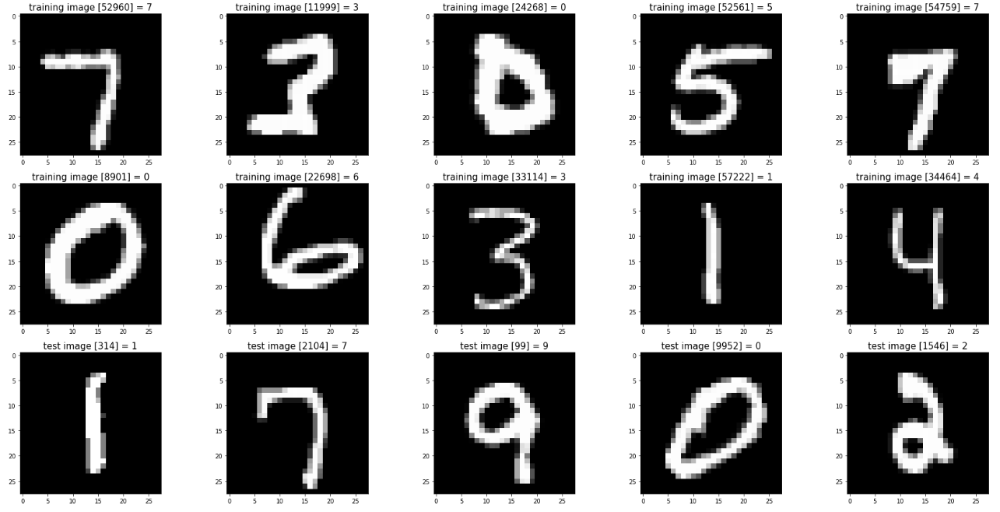

# Fondamentaux de l'intelligence artificielle -2

##  Activité 1: Approche symbolique et approche connexionniste

Cette activité aborde une question fondamentale en intelligence artificielle : **comment un ordinateur peut-il reconnaître un chiffre écrit** ?

   
   
  <em>Figure 1 : Extrait de la base de données <a href="https://en.wikipedia.org/wiki/MNIST_database" target="_blank">MNIST</a>, de chiffres écrits à la main et étiquetés par leur valeur.</em>

Pendant longtemps, les informaticiens ont tenté de répondre à cette question en écrivant des règles explicites — c'est ce qu'on appelle l'**approche symbolique**, ou les systèmes experts. Cette approche a connu de grands succès dans certains domaines, mais s'est heurtée à des limites profondes dès qu'il s'agissait de traiter des données issues du monde réel, comme l'écriture manuscrite.

Dans cette activité, vous allez explorer ces limites par vous-même, en tentant de construire un tel système pour la reconnaissance de chiffres en 10x10 pixels. Vous verrez pourquoi cette tâche, intuitivement simple pour un humain, résiste à toute tentative de description par des règles.

Cette expérience motivera l'introduction d'une approche radicalement différente : l'**approche connexionniste**, dans laquelle le programme n'est plus programmé avec des règles, mais apprend à partir d'exemples.

**Durée estimée :** 20 minutes

[Lancer l'activité](https://nablanabla.github.io/Fondamentaux-de-l-IA_2/phase1-symbolique/)

---

##  Activité 2: L'approche connexioniste, l'exemple du perceptron

---

## Utilisation pédagogique

**Public visé :** Étudiants de premier et deuxième cycle

**Prérequis :** Aucun prérequis en informatique. Une familiarité avec la notion de fonction et de variable est suffisante.

**Contexte :** Cours "Culture Numérique en Sciences de la Santé"

---

## Auteur

**Alban Da Silva**
Chargé d'Enseignement en Médecine — Faculté de Médecine
Université Laval, Québec, Canada

---

## Licence

Ce contenu pédagogique est sous licence [Creative Commons BY-NC-SA 4.0](https://creativecommons.org/licenses/by-nc-sa/4.0/).

Vous êtes libre de partager et d'adapter ce contenu, sous les conditions suivantes : attribution à l'auteur, pas d'utilisation commerciale, partage dans les mêmes conditions.
